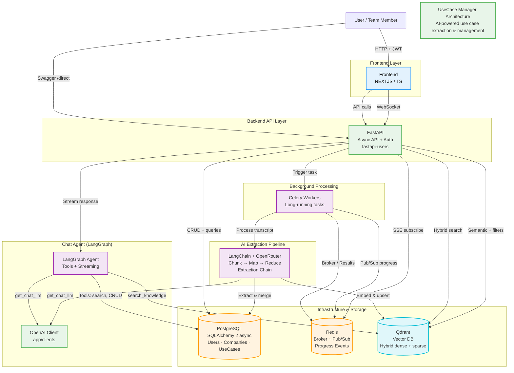
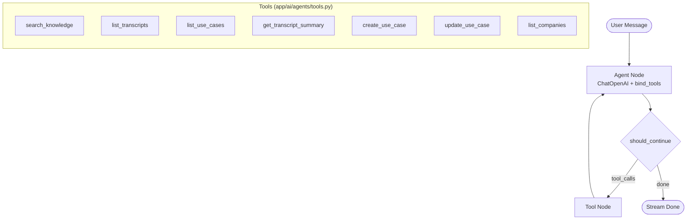

<p align="center">
  
  
  
  
</p>

<h1 align="center">UseCase Manager</h1>

<p align="center">
  <strong>AI-powered use case extraction and management from workshop transcripts.</strong><br />
  Turn messy meeting notes and transcripts into clean, structured use cases — powered by LLMs.
</p>

<p align="center">
  
  <br />
  <em>Visual overview of the UseCase Manager interface and extracted results</em>
</p>

<p align="center">
  <a href="https://github.com/LatVAlY/use-case-manager/stargazers"></a>
  <a href="https://github.com/LatVAlY/use-case-manager/issues"></a>
  <a href="https://github.com/LatVAlY/use-case-manager/blob/main/LICENSE"></a>
</p>

## Table of Contents

- [Table of Contents](#table-of-contents)
- [Features](#features)
- [Quick Start](#quick-start)
  - [Backend (Recommended: Docker)](#backend-recommended-docker)
  - [Backend (Manual / Development)](#backend-manual--development)
  - [Frontend](#frontend)
- [Screenshots](#screenshots)
- [Tech Stack](#tech-stack)
- [System Architecture](#system-architecture)
- [Chat Agent Graph (LangGraph)](#chat-agent-graph-langgraph)
- [Scope Management \& Prioritization](#scope-management--prioritization)
  - [Implemented Must-Have Features (Core of the Assignment)](#implemented-must-have-features-core-of-the-assignment)
  - [Consciously **Not** Implemented Features (Scope Reduction)](#consciously-not-implemented-features-scope-reduction)
  - [Key Trade-offs \& Technical Decisions](#key-trade-offs--technical-decisions)

## Features

- 🤖 **AI-powered extraction** — automatically identifies actors, goals, scenarios from transcripts
- 📊 **Structured use case management** — edit, version, export (Markdown, PDF, Jira-ready)
- ⚡ **Fast & modern stack** — FastAPI backend + modern frontend
- 🐳 **Easy deployment** — one-command Docker Compose
- 🔍 **Semantic search** — powered by Qdrant vector DB
- 📝 **Background processing** — Celery + Redis for long transcript analysis

## Prerequisites

- **Docker & Docker Compose** — for backend + infra
- **Node.js 18+ & Yarn** (or npm) — for frontend
- **OpenRouter API key** — [get one](https://openrouter.ai/keys) for AI features

## Quick Start

### Backend (Recommended: Docker)

One command to rule them all:

```bash
# Clone & enter repo
git clone https://github.com/LatVAlY/use-case-manager.git
cd use-case-manager

# Copy example env files
cp backend/.env.example backend/.env
cp client/.env.example client/.env

# ⚠️ Edit both .env files: add OPENROUTER_API_KEY and SECRET_KEY (backend/.env)

# Start backend + infra (Postgres, Redis, Qdrant, API, Celery worker)
docker compose up --build

# In another terminal: start the frontend
cd client && yarn install && yarn dev
```

→ API will be at http://localhost:8000  
→ Docs / Swagger at http://localhost:8000/docs  
→ Frontend at http://localhost:3000

### Backend (Manual / Development)

```bash
cd backend

# 1. Environment
cp .env.example .env
# Edit .env → add OPENROUTER_API_KEY and SECRET_KEY

# 2. Infrastructure (in background)
docker compose up -d db redis qdrant

# 3. Dependencies
poetry install

# 4. Database migrations
alembic upgrade head

# 5. Run API server
export PROCESS=server
./run.sh

# 6. Run Celery worker (in another terminal)
export PROCESS=worker
./run.sh
```

### Frontend

```bash
cd client

# 1. Environment
cp .env.example .env
# Edit .env if needed (NEXT_PUBLIC_API_BASE_URL defaults to http://localhost:8000)

# 2. Install & start dev server
yarn install
yarn dev
# or: npm install && npm run dev
```

Open http://localhost:3000

## Screenshots


<p align="center">
  
  <br />
  <em>Main dashboard with extracted use cases</em>
</p>

## Tech Stack

- **Backend**: Python 3.11+, FastAPI, SQLAlchemy, Alembic, Celery, Redis, Qdrant
- **AI**: OpenRouter 
- **Frontend**: Next.js + TypeScript 
- **Infra**: Docker Compose, PostgreSQL

## System Architecture



## Chat Agent Graph (LangGraph)

The chat assistant uses a **LangGraph** state machine with tool-calling. The agent loops until no more tool calls are needed.



**Flow:**
1. **Entry** → User message + history (optionally with `AGENT_SYSTEM` prompt)
2. **Agent** → LLM invokes with bound tools; may return tool_calls
3. **should_continue** → If tool_calls present → `tools`, else → `end`
4. **Tools** → Execute tool(s), append results to messages, loop back to Agent
5. **End** → Stream final response to client

**Data flow:** WebSocket → `stream_agent_response` → `graph.astream` (messages + updates) → chunks + tool events → client

## Scope Management & Prioritization

The assignment is deliberately **broader than what can realistically be achieved in 5 days** — exactly as stated in the task description. I therefore consciously prioritized to deliver a **stable, usable, and high-quality core solution** instead of implementing as many features as possible in a half-baked way.

### Implemented Must-Have Features (Core of the Assignment)

- **Transcript Analysis & Use Case Extraction**  
  Upload of text transcripts → automatic chunking → Map-Reduce with LangChain + OpenRouter → structured use-case extraction (title, description, expected benefit, confidence score, tags)  
  → Assignment to company & industry

- **Company, Industry & Person Management**  
  CRUD operations for industries, companies, and persons  
  Persons are captured with name + role and directly assigned to use cases (traceability of idea contributors)

- **Use Case Management (CRUD via Conversational Agent)**  
  Agent-driven via **LangGraph** tools: Create, List (with filters: industry, company, status), Edit  
  Tools: `search_knowledge`, `list_transcripts`, `list_use_cases`, `get_transcript_summary`, `create_use_case`, `update_use_case`, `list_companies`

- **Status Management**  
  Defined lifecycle: New → Under Review → Approved → In Implementation → Completed → Archived  
  Agent can change status + validates transitions

- **Conversational Interface (Agent-First)**  
  **WebSocket chat** with streaming responses and tool events  
  Examples: "Search for AI topics", "List use cases for company X", "Create use case...", "Upload transcript"  
  History persisted per user + company

- **Knowledge Base & Hybrid Search**  
  Qdrant with dense (OpenAI embeddings) + sparse vectors, RRF fusion  
  Agent uses `search_knowledge` for semantic + keyword search over transcripts and use cases

- **Centralized OpenAI Client**  
  Single source (`app/clients/openai_client.py`) for embeddings and chat LLM  
  Config-driven: `EMBEDDING_MODEL`, `CHAT_MODEL` from env

- **User Authentication & Roles**  
  Registration / Login (FastAPI-Users + JWT)  
  Roles: Reader (read-only), Maintainer (CRUD + evaluation), Admin (user management)  
  Roles are consistently enforced in both **API** and **Agent**

- **Modern Frontend with Bidirectional Sync**  
  React / Next.js + TypeScript UI  
  Agent actions appear live in the list  
  Manual UI changes are immediately available in the agent context

### Consciously **Not** Implemented Features (Scope Reduction)

| Feature (from assignment)                  | Why not implemented?                                                                   | Prioritization reason                              |
|--------------------------------------------|----------------------------------------------------------------------------------------|----------------------------------------------------|
| Relationships between Use Cases            | Would require graph DB or extended relations → high effort for nice-to-have            | Focus on stable core functions (extraction + management) |
| Cross-industry intelligence / networking potential | Complex queries + UI presentation → time-consuming                                    | Must-have was agent-driven library, not analytics dashboard |
| Evaluation & Prioritization (effort/benefit scores) | Basic scores implemented, but no full prioritization logic + sorting                  | Time prioritized for robust agent + sync           |
| Roadmap generation                         | Nice-to-have, dependency graph + timeline UI → very time-intensive                    | Outside realistic 5-day scope                      |
| Multi-transcript deduplication             | Deduplication per transcript exists, but no cross-transcript merge                    | Single-transcript focus sufficient for MVP         |
| Graphical visualization / graphs           | Mermaid architecture diagram present, but no use-case relationship graph              | Visual library would be bonus, not core            |
| Comprehensive tests                        | Basic unit tests for extraction + API present, but no E2E tests                       | Core logic quality > test coverage under time pressure |

### Key Trade-offs & Technical Decisions

| Decision                                   | Chosen Solution                                                                | Trade-off / Reason                                                                 |
|--------------------------------------------|--------------------------------------------------------------------------------|------------------------------------------------------------------------------------|
| Backend: FastAPI + SQLAlchemy async + PostgreSQL | Async-capable, strongly typed, excellent OpenAPI docs                         | vs SQLite: Better scalability, full-text search, more production-like             |
| Agent: LangGraph + ChatOpenAI + ToolNode   | State machine with agent→tools loop, streaming + tool events                    | vs pure LangChain: Explicit graph, easier to debug and extend                      |
| OpenAI client: Centralized (app/clients)   | Single `get_openai_client()` + `get_chat_llm()` for embeddings & chat           | vs per-module clients: One config source, consistent OpenRouter usage             |
| LLM: OpenRouter (OpenAI-compatible)        | Chat + embeddings via same API key, model choice via env (CHAT_MODEL, EMBEDDING_MODEL) | vs direct OpenAI: Multi-model support, cost control                              |
| Vector search: Qdrant (hybrid RRF)         | Dense + sparse vectors, Reciprocal Rank Fusion                                 | vs pure dense: Better keyword recall, handles typos and domain terms               |
| Chat: WebSocket (bidirectional)            | Real-time streaming, upload transcripts, persist history per user+company      | vs REST + SSE: Single connection, lower latency for chat                           |
| Frontend: Next.js + React Server Components| SSR + good SEO, simple state sync with agent                                   | vs plain Vite/React: Slightly more boilerplate, but better UX + data fetching      |
| Auth: fastapi-users (JWT + DB)             | Proven, quick to implement                                                     | vs NextAuth: Backend-centered auth → simpler RBAC in agent                        |
| No dedicated graph DB for relations        | Relations stay in Postgres (for MVP)                                           | vs Neo4j: No additional service → simpler deployment                               |
