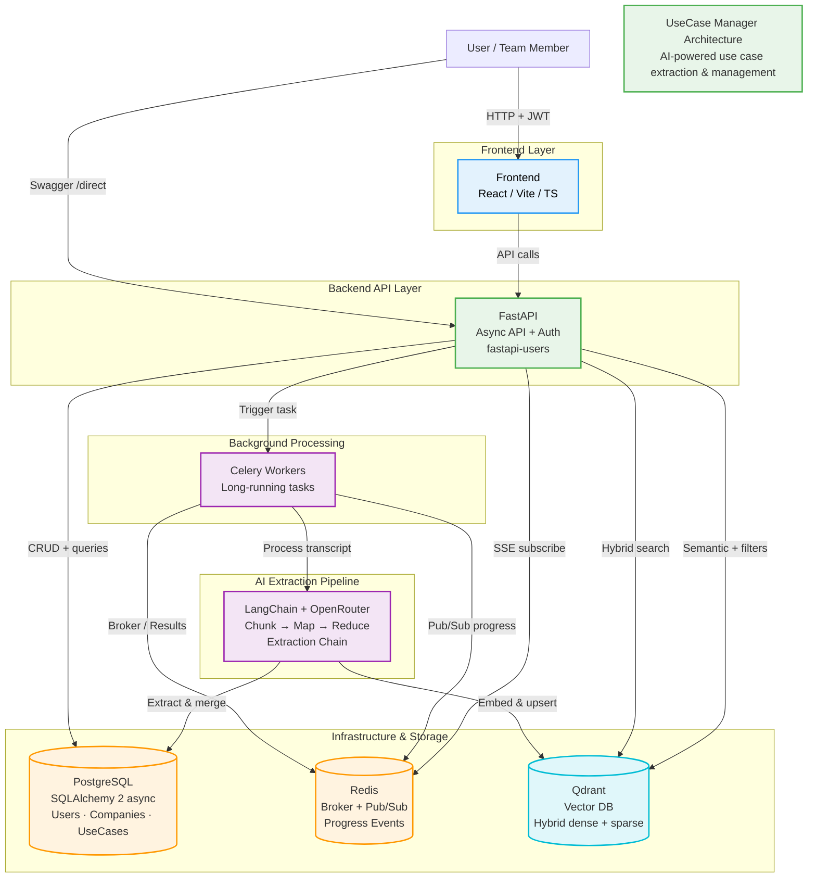

<p align="center">
  
  
  
  
</p>

<h1 align="center">UseCase Manager</h1>

<p align="center">
  <strong>AI-powered use case extraction and management from workshop transcripts.</strong><br />
  Turn messy meeting notes and transcripts into clean, structured use cases — powered by LLMs.
</p>

<p align="center">
  
  <br />
  <em>Visual overview of the UseCase Manager interface and extracted results</em>
</p>

<p align="center">
  <a href="https://github.com/LatVAlY/use-case-manager/stargazers"></a>
  <a href="https://github.com/LatVAlY/use-case-manager/issues"></a>
  <a href="https://github.com/LatVAlY/use-case-manager/blob/main/LICENSE"></a>
</p>

## Table of Contents

- [Features](#features)
- [Quick Start](#quick-start)
  - [Backend (Recommended: Docker)](#backend-recommended-docker)
  - [Backend (Manual / Development)](#backend-manual--development)
  - [Frontend](#frontend)
- [Screenshots](#screenshots)
- [Tech Stack](#tech-stack)
- [Contributing](#contributing)
- [License](#license)

## Features

- 🤖 **AI-powered extraction** — automatically identifies actors, goals, scenarios from transcripts
- 📊 **Structured use case management** — edit, version, export (Markdown, PDF, Jira-ready)
- ⚡ **Fast & modern stack** — FastAPI backend + modern frontend
- 🐳 **Easy deployment** — one-command Docker Compose
- 🔍 **Semantic search** — powered by Qdrant vector DB
- 📝 **Background processing** — Celery + Redis for long transcript analysis

## Quick Start

### Backend (Recommended: Docker)

One command to rule them all:

```bash
# Clone & enter repo
git clone https://github.com/LatVAlY/use-case-manager.git
cd usecase-manager

# Copy example env files
cp backend/.env.example backend/.env
cp client/.env.example client/.env

# ⚠️ Edit both .env files and add your OPENROUTER_API_KEY (and SECRET if needed)

# Start everything (backend + frontend + infra)
docker compose up --build
```

→ API will be at http://localhost:8000  
→ Docs / Swagger at http://localhost:8000/docs  
→ Frontend at http://localhost:3000

### Backend (Manual / Development)

```bash
cd backend

# 1. Environment
cp .env.example .env
# Edit .env → add OPENROUTER_API_KEY and SECRET

# 2. Infrastructure (in background)
docker compose up -d db redis qdrant

# 3. Dependencies
poetry install

# 4. Database migrations
alembic upgrade head

# 5. Run API server
export PROCESS=server
./run.sh

# 6. Run Celery worker (in another terminal)
export PROCESS=worker
./run.sh
```

### Frontend

```bash
cd frontend

# 1. Environment
cp .env.example .env
# Edit .env → add necessary keys if needed

# 2. Start dev server
yarn dev
# or
npm run dev
```

Open http://localhost:3000 (Vite default port)

## Screenshots


<p align="center">
  
  <br />
  <em>Main dashboard with extracted use cases</em>
</p>

## Tech Stack

- **Backend**: Python 3.11+, FastAPI, SQLAlchemy, Alembic, Celery, Redis, Qdrant
- **AI**: OpenRouter 
- **Frontend**: Next.js + TypeScript 
- **Infra**: Docker Compose, PostgreSQL

## System Architecture


